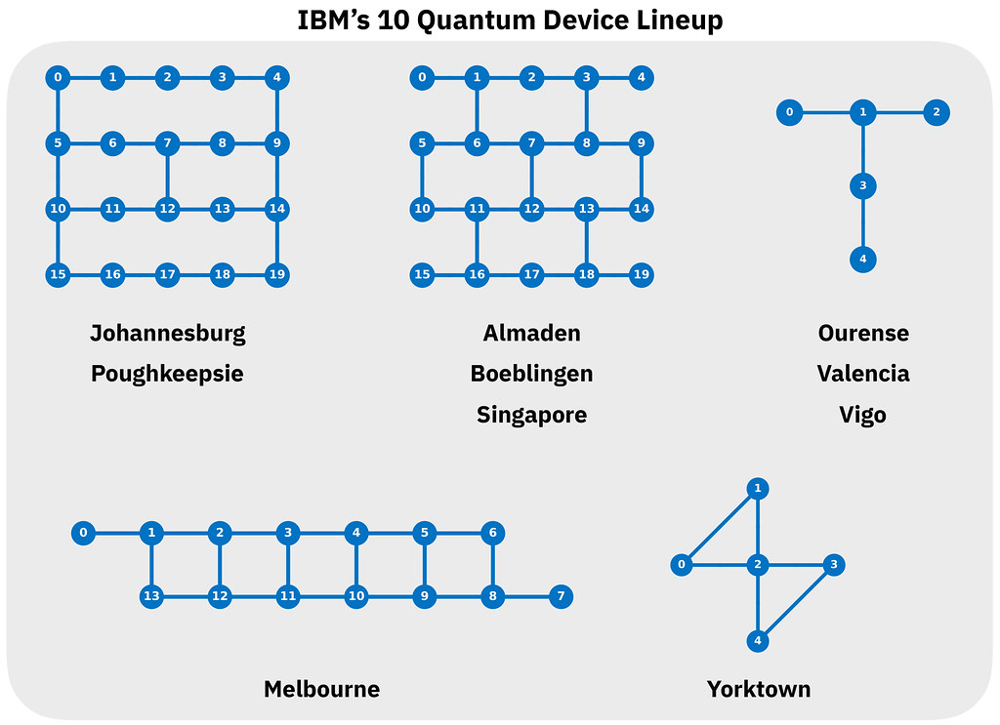

# Qiskit implementation and experiments

## Qiskit Backends
```
# Imports
from qiskit import IBMQ

# Load IBMQ account
provider = IBMQ.load_account()
provider.backends()
```
#### Difference between Aer and BasicAer
BasicAer is a local Python simulator that is quite slow compared to Aer (also local) or the ibmq_qasm_simulator (cloud). Have a look at [this Slack post](https://app.slack.com/client/T7RSPHKK2/C88B13092/thread/C7SJ0PJ5A-1577387522.061100) answered by Paul Nation.


From https://flickr.com/photos/ibm_research_zurich/48762365182/

### Qasm simulator (BasicAer)
```
backend_name = 'qasm_simulator'
backend = BasicAer.get_backend( backend_name)
```

### IBMQ Vigo
```
backend_name = 'ibmq_vigo'
backend = provider.get_backend(backend_name)
noise_model = NoiseModel.from_backend(backend)        # Noise model from backend
coupling_map = backend.configuration().coupling_map   # Get coupling map from backend
basis_gates = noise_model.basis_gates                 # Get basis gates from noise model
```

## Errors
- `Warning: The skip Qobj validation does not work for IBMQ provider. Disable it.` This was solved [here](https://quantumcomputing.stackexchange.com/questions/8269/backend-warning-the-skip-qobj-validation-does-not-work-for-ibmq-provider-disab). From the [documentation](https://qiskit.org/documentation/stubs/qiskit.aqua.QuantumInstance.html):
**skip_qobj_validation (bool, optional)** – Bypass Qobj validation to decrease circuit processing time during submission to backend.

